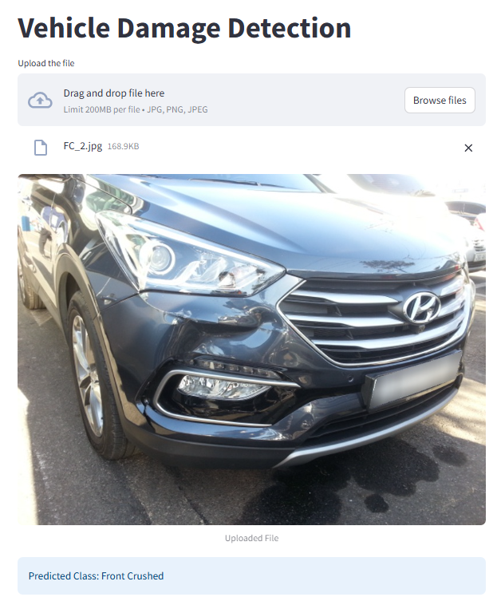

# 🚗 Car Damage Detection App

This project was developed as part of the Codebasics Data Science Bootcamp. The goal is to build a car damage detection system for a car rental company. The system allows clients to upload a photo of a returned vehicle, and the app automatically identifies whether the car is damaged and, if so, classifies the type of damage.

## 🧠 Use Case

Car rental companies face frequent losses due to undetected or misreported vehicle damage. This solution provides a fast, automated way to detect visible damage, reducing manual inspection time and increasing reliability.

The system classifies an uploaded image into one of six categories:
- **Front Normal**
- **Front Crushed**
- **Front Breakage**
- **Rear Normal**
- **Rear Crushed**
- **Rear Breakage**

## 🏗️ Model Development

### 🔍 Challenges
- Streamlit.io uses cpu for the free version
- Limited training data (2,300 images)
- Some categories are visually difficult to distinguish, even for humans

### ✅ Approach
- Built a **Convolutional Neural Network (CNN)** as baseline
- Applied **data augmentation** to increase dataset variability
- Resized all images to **224x224 pixels**
- Normalized images using **ImageNet mean and standard deviation**
- Loaded the model in CPU on Streamlit for the live app, it predicts a bit slower but still works fine

### 🔄 Transfer Learning
Due to data limitations, transfer learning was used. After testing multiple pretrained models, **ResNet** emerged as the best performer.

### ⚙️ Optimization
- Used **Optuna** for hyperparameter tuning
- Applied regularization techniques to reduce overfitting

### 📊 Results
- Achieved **78% accuracy**, exceeding the 70% minimum requirement
- Given dataset limitations and task complexity, this is a solid result

## 🖥️ Streamlit App

A lightweight and user-friendly **Streamlit** app allows users to upload a car image and get an instant prediction. The app predicts one of the six classes, enabling faster, automated car return inspections.

## 🖼️ Screenshot

Here's how the app looks in action:




## 📁 Project Structure

```
├── streamlit-app/
│ ├── app.py # Streamlit frontend
│ ├── model/
│ │ └── saved_model.pth # Trained ResNet model
│ ├── model_helper.py # Helper functions for prediction
│ ├── app_screenshot_1.png # Screenshot of app UI
│ ├── app_screenshot_2.png # Screenshot of app UI
│ ├── app_screenshot_3.png # Screenshot of app UI
│ ├── img.png
│ ├── my_car.png # pic taken to a random car for testing purpose
│ ├── pic_taken_in_a_mall.png # pic taken to another random car for testing purpose
│ └── temp_file.jpg
├── README.md
└── requirements.txt
```

## 🚀 How to Run the App Locally

1. Clone the repository:
   ```bash
   git clone https://github.com/yourusername/damage-prediction.git
   cd damage-prediction
   ```

2. Install the required dependencies:
   ```bash
   pip install -r requirements.txt
   ```

3. Launch the Streamlit app:
   ```bash
   streamlit run app/app.py
   ```

## 📌 Future Improvements

- Increase dataset size and diversity for better generalization
- Add bounding boxes to highlight damaged areas
- Include confidence scores and visual explanations (e.g., Grad-CAM)

---

Feel free to ⭐️ this repo if you found it helpful or would like to see continued improvements!
